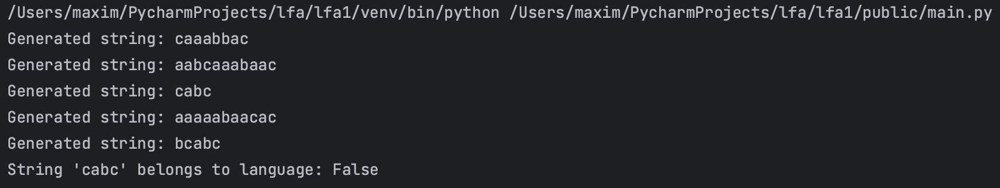
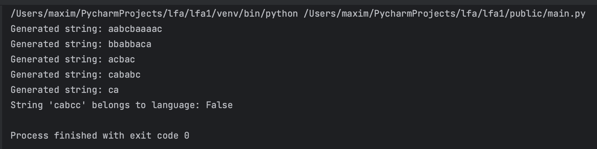

# Intro to formal languages. Regular grammars. Finite Automata.

## Task
Developer a formal language defined by a regular grammar. For this and subsequent laboratory works, I implement the variant number 15.

Below is the grammar that is to be developed for variant 15:
```latex
 V_N={S, A, B},
 V_T={a, b, c},
 P={
     S → aS
     S → bS
     S → cA
     A → aB
     B → aB
     B → bB
     B → c
}
```

## Implementation
### Choice of language
Since this laboratory work will serve as the template for all subsequent laboratory works for this subject, I had to invest time into thinking which programming language to choose. After considering Java, C++, JavaScript, I have finally decided to choose Python. This language offers maximum flexibility, so that I can fully focus on the implementational aspects and not have to worry about techincal issues. So, I will be using Python for this subject.

### Analyzing the Grammar
As defined by the laboratory work task, we have to implement a regular grammar. Analyzing the given variant, we can conclude that the only final state is `(B →) c`, since it is the only rule which leads to only a single terminal symbol.

### Implementing Grammar
An instance of the Grammar class should include non-terminal, terminal and production rules for the given grammar. These properties were implemented using dictionaries to ensure uniqueness and to optimize `in` and lookup operations. For production rules, the values are tuples to ensure their immutability, since these rules should not change throughout the execution of the program. 

To generate a random string from the given grammar, we start off from the start symbol and then randomly apply production rules based on the non-terminal symbols left in the resulting word. As soon as there are no non-terminals left, we can return the word.

To generate the Finite Automaton (described in next section), we have to define the states (non-terminal symbols + final state), transitions and the alphabet, which will be passed to the Finite Automaton instance accordingly.

### Implementing Finite Automaton
The FiniteAutomaton class implements a finite automaton designed to determine whether a given string belongs to the language. It utilizes sets for efficient state and alphabet management and dictionaries for fast lookup of state transitions. The class defines states, an alphabet, transition rules, an initial state, and a set of final states. The `string_belong_to_language` method processes an input string, ensuring that the initial word belongs to the defined alphabet while following valid transitions. If the string reaches correct state, it is considered valid.

The implementation uses sets for storing states, the alphabet, and final states. This choice ensures uniqueness while providing fast membership checking. Dictionaries are used for transition mappings, allowing quick state transitions by mapping an input symbol to its corresponding state. This nested dictionary structure optimizes lookup speed, making the automaton efficient in handling state changes.

This approach offers several advantages over alternative implementations. Using sets instead of lists ensures faster membership checks, eliminating the need for iterative searches. Similarly, using a nested dictionary for transitions allows direct state-input mapping, avoiding the inefficiencies of a flat dictionary structure. Additionally, the class provides dynamic state modifications through methods like `add_transition`, `set_start_state`, and `add_final_state`, allowing the automaton to be updated without reconstruction (similar to using setters and getters in OOP, which is usually a good practice).

Compared to alternative implementations that might use lists for state storage or a flat dictionary for transitions, this design prioritizes speed and adaptability. Even though lists are easier, they introduce slower membership checks, and flat dictionaries lack the efficiency of structured state-input mappings. By structuring the automaton in this manner, the implementation remains optimized for both performance and flexibility, making it a robust choice for deterministic finite state recognition.

### Implementation showcase
The main of the project generates five different words that can be generated by the given language. After printing these 5 words, the program proceeds to identify whether or not a certain word belongs to the implemented language. Obviously, if the program checks one of the generated strings, the result will be always True. In case it is not possible to achieve the given word with this grammar, the program return False.

Below is the first example of the executed program. The first five lines are the generated strings, which are words from the language. After that, the program tries to assess whether or not the word 'cabc' is part of the language. It can be easily followed by the production rules that this word can indeed be generated by the current grammar.


Another example of execution is when the word cannot be generated by the grammar. The program will output False, which is demonstrated in the example below 


## Conclusion
The FiniteAutomaton class provides an efficient and well-structured approach to implementing a finite automaton, ensuring performance and adaptability. By using sets for quick lookups and dictionaries for optimized state transitions, the design guarantees efficient processing of input strings while maintaining a modular and easily extendable structure. This implementation serves well for further computational applications in formal language processing.