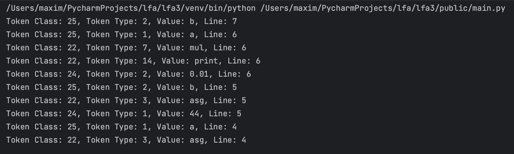
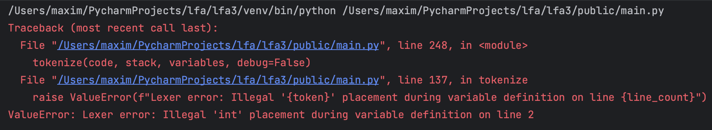

# Lexer & Scanner

### Course: Formal Languages & Finite Automata
### Author: Iacovlev Maxim

----

## Theory

A **Lexer**, also known as a lexical analyzer, is a fundamental component of a compiler or interpreter that processes input text and converts it into a sequence of tokens. A token is a structured representation of meaningful elements in a programming language, such as keywords, identifiers, literals, operators, and punctuation. The lexer plays a crucial role in breaking down the raw input into a form that is easier for subsequent stages, like parsing, to process.  

- A lexer operates using a set of predefined rules, often specified using regular expressions or finite automata, to recognize and classify different tokens. It scans the input sequentially, grouping characters into meaningful units.  
- The concept of lexical analysis can be related to finite automata, as a lexer can be implemented using **Deterministic Finite Automata (DFA)** or **Nondeterministic Finite Automata (NFA)** to efficiently recognize token patterns.  

A **Deterministic Lexer** follows a strict rule where, given a current state and an input character, there is only one possible next state. This approach ensures predictability and efficiency. On the other hand, a **Nondeterministic Lexer** may have multiple possible transitions for a given input, requiring additional steps to resolve ambiguity, such as backtracking or lookahead techniques.  

Lexers can be categorized based on their complexity and functionality:  
- **Simple Lexers** work with a basic set of rules and operate in a single pass, making them efficient for straightforward tokenization tasks.  
- **Complex Lexers** may involve multiple passes, require symbol tables, and handle context-sensitive lexical analysis, such as resolving reserved keywords from identifiers.  

Despite its role as a separate phase in many compiler architectures, lexical analysis is closely tied to syntax analysis, as the output of the lexer serves as the input for the parser. Optimizing the lexer for efficiency ensures faster and more reliable language processing.

## Implementation Details
### **Token Definition**
Tokens are defined using integer constants representing different types of tokens, such as `INT`, `FLOAT`, `ASG` (assignment), `ADD` (addition), and others. These constants are used to classify and identify tokens during the tokenization process. For example, `INT` represents an integer type, while `OPERATION` represents a mathematical or logical operation.

Below is the list of all possible tokens that the language can handle:
```python
TYPE_NONE = 0
INT = 1
FLOAT = 2
ASG = 3
ADD = 4
SUB = 5
DIV = 6
MUL = 7
EQ = 8
GT = 9
LT = 10
NOT = 11
AND = 12
OR = 13
PRINT = 14
INPUT = 15
WHILE = 16
IF = 17
ELSE = 18
PUNCT = 19
L_BRACE = 20
R_BRACE = 21
OPERATION = 22
COND_OP = 23
VALUE = 24
ID = 25
```

---

### **Variable, Node, and Stack Types**
A `Variable` class represents a variable in the language, storing its name, type (e.g., `INT` or `FLOAT`), and value.
```python
class Variable:
    def __init__(self, name: str, var_type: int, value: Union[int, float] = 0):
        self.name = name
        self.type = var_type
        self.value = value
```

A `Node` class represents a token in the lexer. It stores the token's class (e.g., `OPERATION` or `VALUE`), type (e.g., `INT` or `ADD`), value (e.g., `10` or `x`), and the line number where it appears in the source code.
```python
class Node:
    def __init__(self, tok_class: int = TYPE_NONE, tok_type: int = TYPE_NONE, value: str = "", line: int = 0):
        self.tok_class = tok_class
        self.tok_type = tok_type
        self.value = value
        self.line = line
        self.next = None
```

A `Stack` class is used to store nodes in a Last-In-First-Out (LIFO) manner. It supports appending nodes and printing the stack's contents for debugging.
```python
class Stack:
    def __init__(self):
        self.top = None

    def append(self, node: Node) -> bool:
        if not self.top:
            self.top = node
        else:
            node.next = self.top
            self.top = node
        return True

    def print_stack(self):
        current = self.top
        while current:
            print(
                f"Token Class: {current.tok_class}, Token Type: {current.tok_type}, Value: {current.value}, Line: {current.line}")
            current = current.next
```

---

### **Tokenization Process**
The `tokenize` function processes the input code character by character, identifying tokens based on predefined rules. Spaces, tabs, and newlines are used to separate tokens. Tokens are classified as variables, integers, floats, operations, or punctuation (e.g., `{`, `}`). Variable names are validated using a regular expression (`IS_VAR`). Valid tokens are appended to the stack as nodes for further processing.
Below is an example of how a token is handled inside `tokenize` function:
```python
elif token == "float":
    if curr_type != TYPE_NONE:
        raise ValueError(f"Lexer error: Illegal '{token}' placement during variable definition on line {line_count}")
    if depth > 0:
        raise ValueError(f"Lexer error: Definition of variable in main block on line {line_count}")
    curr_type = FLOAT
    skip_append = True
```
---

### **Error Handling**
Errors are handled using Python exceptions. Common errors include:
- **Invalid Token Placement**: Detecting illegal placements of tokens (e.g., defining a variable inside a code block).
```python
raise ValueError(f"Lexer error: Illegal '{token}' placement during variable definition on line {line_count}")
```
- **Variable Redefinition**: Preventing the redefinition of an existing variable.
```python
raise ValueError(f"Lexer error: Redefining variable '{token}' on line {line_count}")
```
- **Unmatched Brackets**: Ensuring all `{` and `}` brackets are properly balanced.
```python
raise ValueError(f"Lexer error: Extra right bracket on line {line_count}")
```
- **Unexpected Tokens**: Raising errors for unrecognized or invalid tokens.
```python
raise ValueError(f"Lexer error: Unexpected token '{token}' on line {line_count}")
```

---

### **Example Program**
This example program demonstrates the lexer's functionality using a simple program with variable declarations, assignments, and a print statement. The `tokenize` function processes the code and builds a stack of tokens. The `print_stack` method displays the stack's contents, showing the token class, type, value, and line number for each token.

```python
code = """
int a
float b
{
  asg a 44
  asg b 0.01
  print mul a b
}
"""
stack = Stack()
variables = []
MAX_VAR_AMOUNT = 100
tokenize(code, stack, variables, debug=False)
stack.print_stack()
```

Below is the output of this program. It can be seen that the stack is formed bottom to top. To parse this stack, it would be necessary to traverse from the last token to the first one.



Below is another example of the program output. When trying to define the variable as `int int`, the name "int" is already reserved, so an appropriate error should be shown. This is exactly what happens and it can be seen in the screenshot below.



---- 

## Conclusion
In this laboratory work, there were explored the fundamentals of lexical analysis, which is the first phase of compiling or interpreting a programming language. The goal was to understand how a lexer (also known as a scanner or tokenizer) breaks down source code into meaningful tokens, which are the building blocks for further processing. By implementing a sample lexer in Python, I gained hands-on experience with its inner workings, which includes defining and categorizing tokens such as integers, floats, variables, and operators, writing logic to process input code character by character, identify tokens, and handle whitespace and special characters, implementing robust error detection for invalid token placements, variable redefinitions, and unmatched brackets, and using stacks and nodes to organize and store tokens efficiently.

The example program demonstrated how the lexer processes a simple math language, tokenizing input code and producing a structured output. This exercise not only clarified the role of a lexer in a compiler or interpreter but also provided a foundation for building more advanced language processing tools. 

