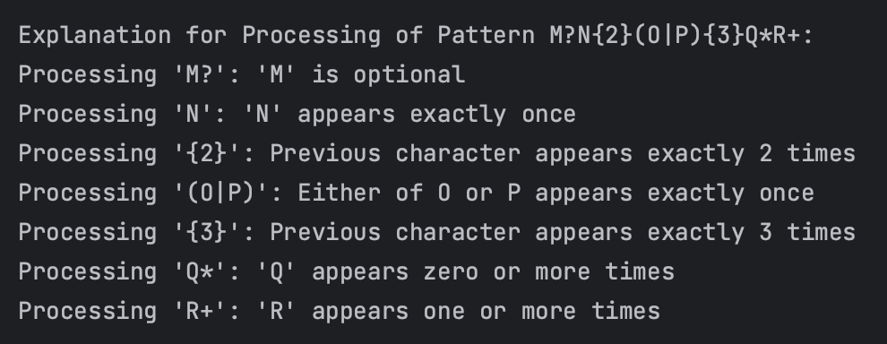
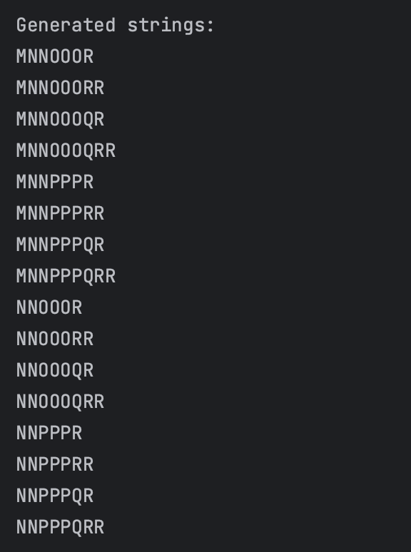

# Regular Expressions

### Course: Formal Languages & Finite Automata
### Author: Iacovlev Maxim

----

## Theory
Regular expressions (regex) are used in computing for pattern matching and text manipulation. They originated from formal language theory and enable identifying text strings that match specified patterns. Regex uses a set of characters to define these patterns, making it possible to perform complex search, validation, and text transformation operations efficiently.The syntax of regex includes literals, character classes, quantifiers, and position anchors to craft patterns for matching a wide range of strings. Despite their versatility, regex can be complex due to their concise syntax and variations across different programming environments. This complexity, however, is offset by their powerful capability to automate and streamline text processing tasks.
Regular expressions are a critical tool for programmers, data scientists, and system administrators, enhancing text data interaction and analysis. Mastery of regex opens up vast possibilities for text manipulation, making it a valuable skill in computer science.

## Objectives:
1. Write and cover what regular expressions are, what they are used for;
2. Below you will find 3 complex regular expressions per each variant. Take a variant depending on your number in the list of students and do the following:
    a. Write a code that will generate valid combinations of symbols conform given regular expressions (examples will be shown).
    b. In case you have an example, where symbol may be written undefined number of times, take a limit of 5 times (to evade generation of extremely long combinations);
    c. **Bonus point**: write a function that will show sequence of processing regular expression (like, what you do first, second and so on)

## Variant 


## Implementation Description
The `SimpleRegexGenerator` class represents a tool designed to illustrate the inner workings of regular expressions through the generation of valid symbol combinations and the methodical explanation of pattern processing. This class effectively demystifies complex regex patterns by breaking down their components and sequentially explaining each part's role.

**Core Functionalities**
1) **Methodological Explanation**: The `explain_process` method offers a detailed, step-by-step explanation of the regex pattern processing. This pedagogical approach is instrumental in clarifying the significance of each regex component, thereby enhancing the user's understanding of pattern matching mechanics.

```python
    def explain_process(self):
        """Prints the explanation of how the pattern was processed."""
        print("\nExplanation of Pattern Processing:")
        for step in self.explanation:
            print(step)
        print("\n")
```
   
2) **Dynamic Pattern Generation**: Utilizing Python's `itertools.product`, the `generate_strings` method dynamically produces all possible string combinations from the decomposed regex pattern components. This functionality highlights the regex's capability to succinctly represent a vast array of string variations, showcasing its power in text processing.

```python
    def generate_strings(self, parts):
        """
        Generate strings from the parsed pattern components.
        """
        for combination in itertools.product(*parts):
            yield ''.join(combination)
```

3) **Modular Pattern Parsing**: The `parse_pattern` function breaks down the regex pattern into its fundamental components, applying specific logic based on the nature of each component (e.g., quantifiers, groups, optional elements). This modular parsing is critical for generating accurate string combinations and for the instructional breakdown of the pattern processing sequence.

```python
    def parse_pattern(self):
        """
        Parses the simplified pattern into components, with explanations.
        """
        parts = []
        i = 0
        while i < len(self.pattern):
            if self.pattern[i] == '(':
                end = self.pattern.find(')', i)
                if end == -1:
                    raise ValueError("Unmatched parenthesis")
                group = self.pattern[i+1:end].split('|')
                parts.append(group)
                self.add_explanation(self.pattern[i:end+1], "Either of " + " or ".join(group) + " appears exactly once")
                i = end + 1
            elif self.pattern[i] == '{':
                end = self.pattern.find('}', i)
                if end == -1:
                    raise ValueError("Unmatched curly brace")
                repeat = int(self.pattern[i+1:end])
                if parts:
                    last_part = parts.pop()
                    parts.append([''.join([c]*repeat) for c in last_part])
                self.add_explanation(self.pattern[i-1:end+1], f"Previous character appears exactly {repeat} times")
                i = end + 1
            elif i + 1 < len(self.pattern) and self.pattern[i+1] in '?*+':
                if self.pattern[i+1] == '?':
                    parts.append([self.pattern[i], ''])
                    self.add_explanation(self.pattern[i:i+2], f"'{self.pattern[i]}' is optional")
                elif self.pattern[i+1] == '*':
                    parts.append(['', self.pattern[i]])
                    self.add_explanation(self.pattern[i:i+2], f"'{self.pattern[i]}' appears zero or more times")
                elif self.pattern[i+1] == '+':
                    parts.append([self.pattern[i], self.pattern[i]*2])
                    self.add_explanation(self.pattern[i:i+2], f"'{self.pattern[i]}' appears one or more times")
                i += 2
            else:
                parts.append([self.pattern[i]])
                self.add_explanation(self.pattern[i], f"'{self.pattern[i]}' appears exactly once")
                i += 1
        return parts
```

**Practical Application with `main.py`**
The driver script `main.py` illustrates the application of the `SimpleRegexGenerator` class by inputting complex regex patterns and producing both the valid combinations and the explanatory processing sequence. This script exemplifies how the class can be leveraged for educational purposes, making it a versatile tool for both learning and development tasks related to regex.

## Results
The output for the `SimpleRegexGenerator` class demonstrates the successful generation of string combinations that conform to the input regex patterns. Additionally, the processing sequence explanations offer insightful revelations into the logic behind regex pattern interpretation, enriching the user's understanding of regex capabilities and applications.

Below is an example of how the developed program shows the explanation for processing of a pattern. Each operation is described, as well as the according operands.



Below is the screenshot of the program output when showing the generated strings. Program generates 15 random string for the given regex, repetitions of which are limited to 2 characters per rule.



## Conclusion
This laboratory work has underscored the pivotal role of regular expressions in text manipulation and pattern matching across various computing disciplines. Through the development and exploration of the `SimpleRegexGenerator` class, we have achieved a comprehensive understanding of regex's functionality and versatility. The ability to generate valid combinations and sequentially explain regex pattern processing has provided invaluable insights, emphasizing the adaptability and efficiency of regex in handling complex text processing tasks. This project has not only met the educational objectives set forth but has also prepared us for advanced applications of regex in computing.

