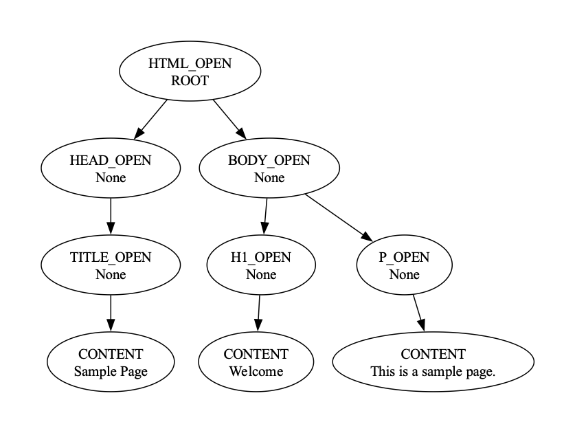

# Abstract Syntax Tree Parsing

### Course: Formal Languages & Finite Automata
### Author: Iacovlev Maxim

----

## Theory
An abstract syntax tree (AST) is a data structure used in computer science to represent the structure of a program or code snippet. It is a tree representation of the abstract syntactic structure of text (often source code) written in a formal language. Each node of the tree denotes a construct occurring in the text. 
It is sometimes called just a syntax tree. The syntax is "abstract" in the sense that it does not represent every detail appearing in the real syntax, but rather just the structural or content-related details. 
For instance, grouping parentheses are implicit in the tree structure, so these do not have to be represented as separate nodes. Likewise, a syntactic construct like an if-condition-then statement may be denoted by means of a single node with three branches. 
This distinguishes abstract syntax trees from concrete syntax trees, traditionally designated parse trees. Parse trees are typically built by a parser during the source code translation and compiling process. 
Once built, additional information is added to the AST by means of subsequent processing, e.g., contextual analysis. Abstract syntax trees are also used in program analysis and program transformation systems. 
Abstract syntax trees are data structures widely used in compilers to represent the structure of program code. An AST is usually the result of the syntax analysis phase of a compiler. 
It often serves as an intermediate representation of the program through several stages that the compiler requires, and has a strong impact on the final output of the compiler.

## Objectives:
1. Get familiar with parsing, what it is and how it can be programmed.
2. Get familiar with the concept of AST.
3. In addition to what has been done in the 3rd lab work do the following:
   1. In case you didn't have a type that denotes the possible types of tokens you need to:
      1. Have a type ```TokenType``` (like an enum) that can be used in the lexical analysis to categorize the tokens. 
      2. Please use regular expressions to identify the type of the token.
   2. Implement the necessary data structures for an AST that could be used for the text you have processed in the 3rd lab work.
   3. Implement a simple parser program that could extract the syntactic information from the input text.


## Implementation description

#### ```TokenType``` Class:
```TokenType``` is an enumeration class representing different types of tokens in a markup language. It defines token types such as html open and close, title open and close, body open and close, paragraph open and close, head open and close, and content.
```python
import enum


class TokenType(enum.Enum):
    HTML_OPEN = 1
    HTML_CLOSE = 2
    HEAD_OPEN = 3
    HEAD_CLOSE = 4
    TITLE_OPEN = 5
    TITLE_CLOSE = 6
    BODY_OPEN = 7
    BODY_CLOSE = 8
    H1_OPEN = 9
    H1_CLOSE = 10
    P_OPEN = 11
    P_CLOSE = 12
    CONTENT = 13

    def __eq__(self, value: object) -> bool:
        return super().__eq__(value)
```
#### Lexer
After that, we need a Lexer, or a simpler implementation of it using a simple function. 
The function ```lexer``` tokenizes a given markdown text into a list of tokens. It initializes an empty list to store the tokens. It iterates through the markdown text while there are still characters remaining. Within each iteration, it strips leading and trailing whitespace from the markdown text. 
It attempts to match the markdown text with predefined token regular expressions. If a match is found, it extracts the matched value, appends the token type and value tuple to the tokens list, and updates the markdown text to exclude the matched portion. 
If no match is found, it raises a SyntaxError indicating an unknown markdown syntax. Finally, it returns the list of tokens representing the tokenized markdown text.
```python
def lexer(html):
    tokens = []
    while html:
        html = html.strip()
        match_found = False
        for token_type, token_regex in TOKENS:
            regex = re.compile(token_regex)
            match = regex.match(html)
            if match:
                value = match.group(0).strip()
                tokens.append((token_type, value))
                html = html[match.end():]
                match_found = True
                break
        if not match_found:
            raise SyntaxError(f'Unknown HTML: {html}')
    return tokens
```
#### Tokens
The tokens represent structural elements and content within a markdown document. 
Each token consists of a token type and a corresponding value. The token types include DOCUMENT_OPEN and DOCUMENT_CLOSE for marking the beginning and end of the document respectively. 
Additionally, there are tokens such as HTML_OPEN, HTML_CLOSE, BODY_OPEN, BODY_CLOSE, HEAD_OPEN, and HEAD_CLOSE for defining hierarchical sections within the document. 
Finally, the CONTENT token captures any content that does not match the structural tokens, allowing for flexible text representation within the markdown document.
```python
TOKENS = [
    (TokenType.HTML_OPEN, r'<html>'),
    (TokenType.HTML_CLOSE, r'</html>'),
    (TokenType.HEAD_OPEN, r'<head>'),
    (TokenType.HEAD_CLOSE, r'</head>'),
    (TokenType.TITLE_OPEN, r'<title>'),
    (TokenType.TITLE_CLOSE, r'</title>'),
    (TokenType.BODY_OPEN, r'<body>'),
    (TokenType.BODY_CLOSE, r'</body>'),
    (TokenType.H1_OPEN, r'<h1>'),
    (TokenType.H1_CLOSE, r'</h1>'),
    (TokenType.P_OPEN, r'<p>'),
    (TokenType.P_CLOSE, r'</p>'),
    (TokenType.CONTENT, r'[^<]*'),  # Match any content not containing '<' or '>'
]
```
#### Abstract Syntax Tree Node Class
The ASTNode class represents a node in an abstract syntax tree (AST), commonly used for structured data representation in parsing tasks. 
It encapsulates essential attributes such as the node type, value, and children nodes. 
The constructor initializes these attributes, allowing flexibility in specifying node properties during instantiation. 
The ```__repr__``` method provides a string representation of the node, including its type, value, and children nodes, facilitating debugging and visualization of the AST structure.
```python
class ASTNode:
    def __init__(self, type, children=None, value=None):
        self.type = type
        self.value = value
        self.children = children if children is not None else []

    def __repr__(self):
        type_name = self.type.name if isinstance(self.type, enum.Enum) else self.type
        return f"{type_name}({self.value}, {self.children})"
```


#### Parser Class

The Parser class orchestrates the parsing of markdown tokens, facilitating the construction of an abstract syntax tree (AST) representing the document structure. 
It encapsulates state variables such as the current node being processed and a stack to manage the document's hierarchical layout efficiently. 
By invoking the parse method, the class initializes the parsing process by setting up the root node and iteratively processes each token to construct the AST. 
The handle_token method delegates the processing of individual tokens based on their type, ensuring the appropriate actions are taken for each. 
For example, when encountering a chapter opening token, the handle_head_open method is invoked to add the chapter node to the AST and update the current node accordingly. 
This class abstracts away the intricacies of parsing markdown documents, promoting maintainability and extensibility of the parsing logic. 
Through its modular design, it enhances code readability and facilitates future enhancements or modifications to the parsing process.
```python
class Parser:
    def __init__(self):
        self.root = None
        self.current_node = None
        self.stack = []

    def parse(self, tokens):
        self.root = ASTNode(TokenType.HTML_OPEN, value="ROOT")
        self.current_node = self.root
        self.stack = [self.root]

        for token_type, value in tokens:
            self.handle_token(token_type, value)

        return self.root

    def handle_token(self, token_type, value):
        if token_type == TokenType.HEAD_OPEN:
            self.handle_head_open()
        elif token_type == TokenType.TITLE_OPEN:
            self.handle_title_open()
        elif token_type == TokenType.BODY_OPEN:
            self.handle_body_open()
        elif token_type == TokenType.H1_OPEN:
            self.handle_h1_open()
        elif token_type == TokenType.P_OPEN:
            self.handle_p_open()
        elif token_type == TokenType.CONTENT:
            self.handle_content(value)
        elif token_type == TokenType.HEAD_CLOSE:
            self.handle_head_close()
        elif token_type == TokenType.TITLE_CLOSE:
            self.handle_title_close()
        elif token_type == TokenType.BODY_CLOSE:
            self.handle_body_close()
        elif token_type == TokenType.H1_CLOSE:
            self.handle_h1_close()
        elif token_type == TokenType.P_CLOSE:
            self.handle_p_close()
        elif token_type == TokenType.HTML_CLOSE:
            self.handle_html_close()

    def handle_head_open(self):
        head_node = ASTNode(TokenType.HEAD_OPEN)
        self.current_node.children.append(head_node)
        self.stack.append(head_node)
        self.current_node = head_node
```

### Execution and result
To test and present this lab, I have created a sample HTML code with following lines. It has a very simple syntax.
```python
html_code = """
<html>
<head>
<title>Sample Page</title>
</head>
<body>
<h1>Welcome</h1>
<p>This is a sample page.</p>
</body>
</html>
"""
```

The processing of such code will result in the following tree:
```
HTML_OPEN(ROOT, [
    HEAD_OPEN(None, [
        TITLE_OPEN(None, [
            CONTENT("Sample Page", [])
        ])
    ]),
    BODY_OPEN(None, [
        H1_OPEN(None, [
            CONTENT("Welcome", [])
        ]),
        P_OPEN(None, [
            CONTENT("This is a sample page.", [])
        ])
    ])
])
```

Where we can clearly see a hierarchy of the document structure defined in the custom language. We observe that the document opens, then it has head, then inside the head there is a title defined, a body with its own distinct paragraph, and the content that follows in the paragraph. This indicates that the execution was correct and we achieved the purpose of parsing and building an AST Tree.



## Conclusion
In conclusion, this laboratory work provided an in-depth exploration of parsing techniques and abstract syntax trees (ASTs), fundamental concepts in formal language processing. Through the implementation of a lexer and parser for a HTML, the lab aimed to demonstrate practical applications of parsing methodologies. By defining a TokenType enumeration and employing regular expressions for token identification, the lexer efficiently transformed markdown text into a sequence of tokens. Subsequently, the Parser class orchestrated the construction of an AST from the token stream, utilizing hierarchical document structures defined in the input markdown. The modular design of the Parser class facilitated extensibility and maintainability, while the ASTNode class provided a flexible representation of nodes within the AST. Execution of the lab's example code successfully produced an AST reflecting the hierarchical structure of the input document, validating the efficacy of the parsing process. Overall, the lab underscored the importance of parsing techniques and ASTs in formal language processing, laying a solid foundation for further exploration and application in compiler construction and program analysis domains.


